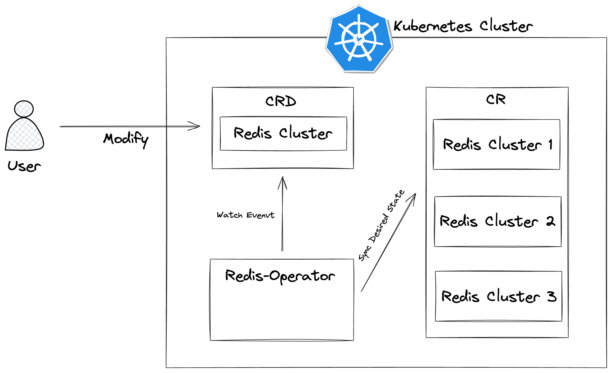
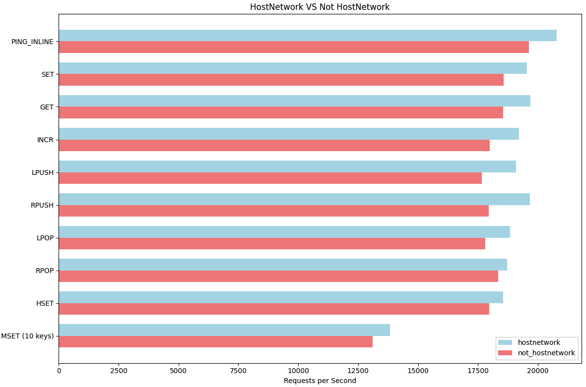
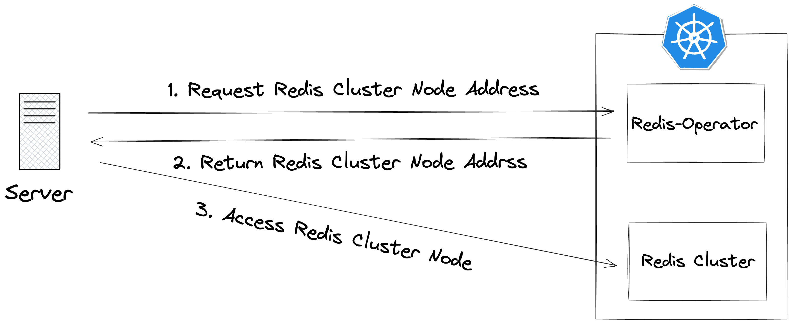

# redis-operator

redis-operator는 Golang 기반의 Operator-SDK를 이용하여 만든, Redis Cluster를 관리하는 Kubernetes Operator입니다.

redis-operator를 사용하면 Redis 클러스터를 손쉽게 생성, 삭제, 확장 및 축소, 모니터링할 수 있습니다.

## How It Works

### Kubernetes Operator Pattern ?

Kubernetes Operator는 Kubernetes의 확장 가능한 API를 활용하여 CRD의 명세를 정의하고, 해당 리소스를 관리하는 패턴입니다. Operator는 CRD에 정의된 리소스를 생성하고 관리하며, 필요한 작업을 수행하여 원하는 상태를 유지합니다.

redis-operator는 Redis Cluster의 생성, 삭제, 확장/축소, 모니터링과 같은 작업을 자동화합니다. Operator는 Redis 클러스터의 상태를 지속적으로 감시하고, 사용자가 정의한 원하는 상태에 맞게 클러스터를 조정합니다.



### HostNetwork

`HostNetwork`는 Kubernetes에서 파드가 호스트의 네트워크 네임스페이스를 공유하도록 하는 설정입니다. 이를 활성화하면 파드는 호스트의 IP 주소와 네트워크 인터페이스를 직접 사용하게 됩니다. 일반적으로는 권장되지 않는 설정이지만, Redis Pod 간의 직접 통신을 통해 네트워크 오버헤드를 줄여 성능적인 이점을 얻을 수 있었습니다.

아래 이미지는 `redis-benchmark`를 사용하여 `HostNetwork` 설정 유무에 따라 초당 처리된 명령어 수를 비교한 결과를 보여줍니다. 테스트 결과에 따르면, HostNetwork를 활성화했을 때 평균적으로 약 1034.96개의 추가 처리량 이점이 있었습니다.

> 자세한 테스트 환경 구성 및 결과는 [링크](https://velog.io/@jaehan/redis-benchmark%EB%A1%9C-%EC%95%8C%EC%95%84%EB%B3%B4%EB%8A%94-Redis-Cluster-%EC%84%B1%EB%8A%A5-HostNetwork-%EC%84%A4%EC%A0%95-%EC%9C%A0%EB%AC%B4%EC%97%90-%EB%94%B0%EB%A5%B8-%EB%B9%84%EA%B5%90)를 참고해 주세요.



### <p name="crd">Redis Cluster CRD</p>

Redis Cluster의 CRD의 Field는 아래와 같이 구성되어 있습니다.

```yaml
apiVersion: redis.redis/v1beta1
kind: RedisCluster
metadata:
  name: rediscluster1
  namespace: cache
spec:
  image: awbrg789/redis:latest
  masters: 3
  replicas: 1
  basePort: 10000
  maxMemory: 512mb
  resources:
    limits:
      cpu: 1
      memory: 1000Mi
    requests:
      cpu: 1
      memory: 1000Mi
  exporterResources:
    limits:
      cpu: 200m
      memory: 128Mi
    requests:
      cpu: 50m
      memory: 64Mi
```

| Parameter         | Description                                 |
| ----------------- | ------------------------------------------- |
| image             | Redis 이미지 이름                           |
| masters           | Redis Master Node 수                        |
| replicas          | Redis Master Node 당 Replica 수             |
| basePort          | Redis Node의 시작 Port 번호                 |
| maxMemory         | Redis Node의 Max Memory 설정                |
| resources         | Redis Node Container의 리소스 설정          |
| exporterResources | Redis Node Exporter Container의 리소스 설정 |

### How to Access Redis Node

Redis Cluster를 구성하고 있는 Redis Node의 주소는 다음과 같이 operator에 HTTP API방식의 요청을 통해
제공받을 수 있습니다.



**Request**

Redis Node의 주소를 얻기 위해서는 다음과 같이 HTTP GET 요청을 보내야 합니다.

- Kubernets 내부

  ```
  GET http://redis-operator-service:9090/cluster/nodes?clusterName={clusterName}
  ```

- Kubernetes 외부

  values.yaml의 redisOperator.service.type을 NodePort, LoadBalancer로 설정하거나, PortForwarding

  ```yaml
  service:
    type: NodePort
  ```

  ```
  GET http://<service-address>/cluster/nodes?clusterName={clusterName}
  ```

  **Response**

요청에 대한 응답은 다음과 같습니다.

```json
[
  {
    "ip": "10.10.80.94",
    "port": 10000
  },
  {
    "ip": "10.10.96.153",
    "port": 10002
  },
  {
    "ip": "10.10.80.94",
    "port": 10001
  }
]
```

## Getting Started

```bash
# Add Helm Repo
$ helm repo add operator https://jaehanbyun.github.io/redis-operator
```

```bash
# Deploy Redis Operator
$ helm upgrade redis-operator operator/redis-operator \
  --install --create-namespace --namespace <your_namespace>
```

redis-operator가 helm으로 배포되고 나면, <a href="#crd">Redis Cluster CRD</a>의 형식을 따라서 manifests를 만들어 Redis Cluster를 배포할 수 있습니다.

또한, 기본적으로, Helm 배포 시 Prometheus와 Grafana를 Sub Chart로 Enable되어 operator와 함께 배포됩니다.

## Demo Video

https://github.com/user-attachments/assets/5b1c55cf-b88d-4eb5-bfd3-a2edefd0d710

## Auto Scaling

redis-operator는 Prometheus와 Alertmanager를 통한 자동 스케일링 기능을 제공합니다. 메트릭 기반으로 Redis 클러스터를 자동으로 확장하거나 축소할 수 있어 리소스를 효율적으로 관리할 수 있습니다.

### 작동 방식

1. Prometheus는 Redis 클러스터의 메트릭(메모리 사용량, 처리량 등)을 지속적으로 모니터링합니다.
2. 설정된 임계값을 초과하면 Prometheus는 알림을 발생시킵니다.
3. Alertmanager는 이 알림을 받아 Redis Operator의 웹훅 엔드포인트(`/webhooks/alertmanager`)로 전달합니다.
4. Redis Operator는 알림 정보를 분석하여 Redis 클러스터의 마스터 노드나 레플리카 수를 자동으로 조정합니다.

### 지원하는 자동 스케일링 시나리오

1. **높은 메모리 사용량 (HighMemoryUsage)**: 메모리 사용량이 80%를 초과하면 마스터 노드 수 증가
2. **높은 처리량 (HighThroughput)**: 초당 명령 처리량이 1000을 초과하면 마스터 노드 수 증가
3. **낮은 메모리 사용량 (LowMemoryUsage)**: 메모리 사용량이 30% 미만이면 마스터 노드 수 감소
4. **낮은 처리량 (LowThroughput)**: 초당 명령 처리량이 100 미만이면 마스터 노드 수 감소

### 설정 방법

자동 스케일링 기능은 Helm 차트의 `values.yaml`에서 설정할 수 있습니다:

```yaml
prometheus:
  enabled: true
  server:
    scrapeInterval: 1m
    evaluationInterval: 1m

redisOperator:
  metrics:
    prometheusRule:
      enabled: true
      rules:
        memoryThreshold: 0.8
        throughputThreshold: 1000
```

## License
